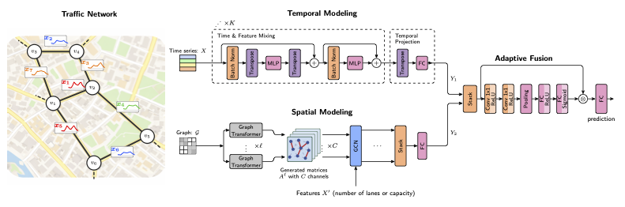

# UniST-Pred
<One-sentence description of what this project does.>

- **Task:** < forecasting>
- **Framework:** < PyTorch>
- **Dataset:** <SimSF-Bay, PEMS-Bay, NYCTaxi>
- **License:** <MIT / Apache-2.0 / Proprietary>
  

## Train and Evaluate
python run_.sh configure_pems

## Data
You can download the data at [Google drive](https://drive.google.com/drive/folders/1IryA0_cDQiHfqVa9g55DJfVigExTQRuZ?usp=drive_link)

## Configuration

Configs are stored in `configs/` (YAML). Sections include:

- `model`: architecture
- `data`: sequence length, target length, nodes
- `train`: learning-rate schedule, epochs, batch size
